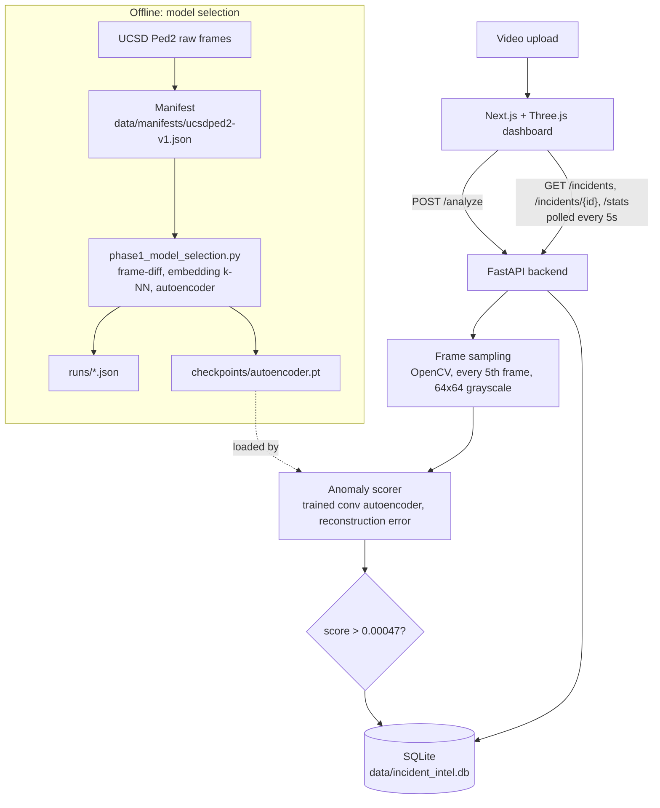

# Incident Intelligence

Video anomaly detection, built end to end: a versioned data pipeline, a real model-selection
comparison across three candidate approaches, a trained PyTorch model, an evaluation against
published benchmarks, a served FastAPI backend, and a Next.js + Three.js dashboard. Not a
notebook. A running system.

| | |
|---|---|
| **Source** | [github.com/Professional50coder/incident-intel](https://github.com/Professional50coder/incident-intel) |
| **Live demo** | None yet. No public deployment exists; see [Deploying](#deploying). |
| **Model-selection write-up** | [`docs/model-selection/phase-1.md`](docs/model-selection/phase-1.md) |
| **Project spec (8 phases)** | [`docs/spec/2026-09-08-project-spec.md`](docs/spec/2026-09-08-project-spec.md) |
| **Deployment guide** | [`docs/deployment.md`](docs/deployment.md) |
| **Dataset** | [UCSD Ped2](http://www.svcl.ucsd.edu/projects/anomaly/dataset.html) |

**At a glance**

- Upload a video clip; the API samples every 5th frame, scores each one with a trained
  convolutional autoencoder, and stores the result as an incident in SQLite.
- Three candidates were compared on the same UCSD Ped2 test set before anything was served.
  Every number is recorded in [`runs/`](runs) with the git commit that produced it.
- The dashboard shows KPI tiles, a live incident feed, and a 3D per-frame score timeline.

## Contents

1. [The problem we solve](#the-problem-we-solve)
2. [Why we built it](#why-we-built-it)
3. [What it does](#what-it-does)
4. [Use cases](#use-cases)
5. [Product tour](#product-tour)
6. [How it works](#how-it-works)
7. [Architecture](#architecture)
8. [Models and why](#models-and-why)
9. [Design decisions](#design-decisions)
10. [Feature matrix](#feature-matrix)
11. [Trust, security and limits](#trust-security-and-limits)
12. [Where it stands](#where-it-stands)
13. [Tech stack](#tech-stack)
14. [Repository layout](#repository-layout)
15. [Running locally](#running-locally)
16. [Testing](#testing)
17. [Deploying](#deploying)
18. [Roadmap](#roadmap)

## The problem we solve

Given a video clip from a fixed camera (a walkway, a production line, a storefront), flag
which frames look anomalous, show *why* (a live 3D score timeline, not just a number), and
track that across a growing history of analyzed footage.

Anomalies are rare and rarely labeled. The system therefore learns what "normal" looks like
from normal-only footage and scores how far each new frame departs from it.

## Why we built it

The project is a portfolio-grade demonstration of the full ML lifecycle: data, training,
evaluation, serving and UI as one product. It was scoped to real constraints from the start:
one local machine with an NVIDIA RTX 3050 Laptop GPU (4GB VRAM), no rented compute, public
benchmark data only, and no fabricated numbers. Where a later technique does not fit that
hardware, the spec says it gets scoped down and documented, not skipped or faked.

## What it does

| Capability | Problem it removes |
|---|---|
| Checksummed dataset [manifest](src/incident_intel/data/manifest.py) per dataset version | Experiments that cannot be traced back to the exact frames that produced them |
| Three-way model comparison on equal footing | Committing to a model before knowing what simpler baselines achieve |
| Local JSON run log (git commit, config, metrics) in [`runs/`](runs) | Results that live only in a terminal or a third-party tracking service |
| `POST /analyze` video scoring | Manually stepping through footage to find unusual frames |
| SQLite incident history with `/incidents` and `/stats` | Losing results between sessions; no aggregate view |
| Threshold set from the real ROC curve (Youden's J) | A guessed, round-number cut-off |
| 3D score timeline in the dashboard | A single score that hides where in the clip the spike happened |

## Use cases

- **Fixed-camera review.** Score a clip from a walkway, production line or storefront and jump
  to the frames that exceed the threshold.
- **Footage triage over time.** Keep a running history of analyzed clips and watch the anomaly
  rate and average max score across them.
- **ML lifecycle reference.** Read the code and docs as a worked example of manifest-versioned
  data, honest model selection, and a model wired into a real API and UI.

The served checkpoint is trained only on UCSD Ped2 (a pedestrian walkway). Other scenes need
their own normal-only training footage; see [limits](#trust-security-and-limits).

## Product tour

The dashboard ([`dashboard/src/app/page.tsx`](dashboard/src/app/page.tsx)) is a single page:

- **KPI tiles.** Incidents analyzed, frames processed, anomaly rate, average max score.
- **Analyze footage.** Drop or select a video (mp4, avi, mov). The panel shows "running
  inference" until the API responds.
- **Recent incidents.** A live list, polled every 5 seconds, with filename, time, frames
  sampled, and an anomaly / normal badge. Click one to load its timeline.
- **Score timeline.** A Three.js scene: one bar per sampled frame. Height encodes the score;
  red marks frames above the threshold, cyan marks normal ones. Orbit controls, slow
  auto-rotate.
- If the backend is unreachable, a banner asks whether it is running at `NEXT_PUBLIC_API_URL`.

No screenshots are checked in yet.

## How it works

One upload, end to end:

1. The dashboard posts the file as multipart form data to `POST /analyze`.
2. The API writes the upload to a temporary file and opens it with OpenCV.
3. Every 5th frame (`EVERY_NTH_FRAME = 5`) is converted to grayscale, resized to 64x64
   (`FRAME_SIZE` in [`config.py`](src/incident_intel/config.py)) and scaled to `[0, 1]`.
   The temporary file is deleted.
4. If no frames could be read, the API returns `400`.
5. Each frame goes through the autoencoder. The score is the mean squared reconstruction error.
   The checkpoint (`checkpoints/autoencoder.pt`) is loaded lazily on the first request, on CPU.
6. A frame is flagged when its score exceeds `ANOMALY_THRESHOLD = 0.00047`.
7. The result (incident id, UTC timestamp, filename, per-frame scores, max score) is stored as
   JSON in the `incidents` table and returned.
8. The dashboard renders the timeline and refreshes the KPI tiles and incident list.

## Architecture



**Components**

| Component | Path | Role |
|---|---|---|
| Config | `src/incident_intel/config.py` | `FRAME_SIZE = (64, 64)`, shared by loading, training and serving |
| Manifest | `src/incident_intel/data/manifest.py` | SHA-256 per clip, frame count, split |
| Ped2 dataset | `src/incident_intel/data/ped2_dataset.py` | Frame loader; test labels derived from ground-truth masks |
| Baselines | `src/incident_intel/models/baselines.py` | `FrameDiffScorer`, `EmbeddingKNNScorer` |
| Autoencoder | `src/incident_intel/models/autoencoder.py` | `ConvAutoencoder`, reconstruction error, checkpoint I/O |
| Evaluation | `src/incident_intel/eval/metrics.py` | Frame-level AUC-ROC (scikit-learn) |
| Run logger | `src/incident_intel/runs/run_logger.py` | One JSON per run: id, timestamp, git commit, config, metrics |
| Model selection | `src/incident_intel/experiments/phase1_model_selection.py` | Builds the manifest, runs all three candidates, logs results, saves the checkpoint |
| API | `src/incident_intel/api/main.py` | FastAPI app built by `create_app()` with an injectable scorer and DB path |
| Dashboard | `dashboard/` | Next.js App Router UI |

**API**

| Method | Path | Returns |
|---|---|---|
| `POST` | `/analyze` | `IncidentResult`: `incident_id`, `created_at`, `source_filename`, `frame_scores[]` (`frame_index`, `score`, `is_anomalous`), `max_score` |
| `GET` | `/incidents/{incident_id}` | One `IncidentResult`, or `404` |
| `GET` | `/incidents?limit=50` | `IncidentSummary[]`, newest first; adds `is_anomalous` (any frame flagged) and `frame_count` |
| `GET` | `/stats` | `total_incidents`, `total_frames_analyzed`, `anomalous_incident_count`, `anomaly_rate`, `average_max_score` |

**Data.** One SQLite table, `incidents (id, created_at, source_filename, result_json)`.
Created on first connection.

## Models and why

Three candidates were built and evaluated on the same held-out test set, on equal footing:

| Candidate | How it scores | AUC-ROC |
|---|---|---|
| Frame-diff threshold (non-learned) | Mean absolute pixel distance from the mean normal frame | **0.709** |
| Pretrained-embedding k-NN (frozen MobileNetV2) | Mean distance to the 5 nearest normal-frame embeddings | 0.688 |
| Convolutional autoencoder (trained, 20 epochs) | Mean squared reconstruction error | 0.6451 |
| Convolutional autoencoder (trained, 150 epochs; served) | Mean squared reconstruction error | 0.674 |

Raw values are in [`runs/`](runs): `phase1-frame-diff.json` (0.7093),
`phase1-embedding-knn.json` (0.6879), `phase1-autoencoder.json` (0.6742, 150 epochs).

**The autoencoder** has three stride-2 conv layers (1 → 16 → 32 → 64 channels) and a mirrored
transposed-conv decoder ending in a sigmoid. It is trained with Adam (lr 1e-3, batch 32, MSE)
on normal frames only.

**Why the autoencoder is served despite scoring lower.** The full write-up is in
[`docs/model-selection/phase-1.md`](docs/model-selection/phase-1.md). Short version: it is the
only candidate with learnable capacity, which every later phase (training ablations,
synthetic-data augmentation, temporal modeling) builds on. A frame-diff threshold has nowhere
left to go. The gap is modest, not a rout. The reconstruction error is also the natural source
for a future per-region "evidence" view.

**Honest results, not inflated ones.** These AUC numbers sit below the ~90-95% the anomaly
detection literature reports on this benchmark. That gap is explained, not hidden:

- Frames are downsampled to 64x64 grayscale (from Ped2's native 240x360) to fit comfortably in
  4GB of VRAM.
- Every candidate scores single frames independently. No motion information crosses frame
  boundaries, which is a real structural limit for a benchmark whose anomalies (cyclists,
  carts) are defined by motion.
- More epochs helped the autoencoder but plateaued short of the frame-diff baseline.

Closing that gap with a temporal model is a planned later phase, not a hidden problem.

**Evaluation threshold** is set from the trained model's actual ROC curve (Youden's J
statistic), not a guessed round number: `0.00047`, at a true positive rate of about 0.38 and a
false positive rate of about 0.10 on the Ped2 test set.

## Design decisions

| Decision | Why | Trade-off |
|---|---|---|
| Serve the autoencoder, not the top-scoring frame-diff baseline | Only candidate with learnable capacity for later phases | Gives up about 0.035 AUC today |
| 64x64 grayscale frames | Training fits comfortably in 4GB VRAM | Loses small-object detail; part of the gap to published results |
| Evaluate on the full official Ped2 test set | Ped2 has only 12 test clips; matches how the literature reports | Model selection and reporting reuse the same data; documented as a limitation |
| Checksummed manifest per dataset version | Any run is traceable to exact frames | One extra step on every dataset change |
| Local JSON runs, no MLflow or W&B | No telemetry shipped to a third-party cloud | No built-in experiment UI yet (planned, Phase 6) |
| `create_app()` with injectable scorer and DB path | Tests run without a trained checkpoint on disk | Slightly more wiring than a module-level app |
| Lazy checkpoint load | The module imports cleanly before a checkpoint exists | First `/analyze` call pays the load cost |
| CPU-only Docker image for serving | Inference on a small model needs no GPU; image is smaller and portable | Retraining needs a separate GPU setup |
| Backend off Vercel serverless | Package size, cold starts, ephemeral filesystem, execution limits | Two deploy targets instead of one |
| Plain `three`, no react-three-fiber | Small dependency footprint for a simple scene | More manual setup and cleanup code |
| Checkpoint committed to the repo | Small enough (about 190 KB); the API works after clone | Binary in git history |

## Feature matrix

| Feature | Status |
|---|---|
| Versioned, checksummed dataset manifest | Built |
| Frame-diff, embedding k-NN and autoencoder candidates | Built |
| Local run logging with git commit | Built |
| Trained autoencoder checkpoint | Built |
| FastAPI `/analyze`, `/incidents`, `/incidents/{id}`, `/stats` | Built |
| SQLite incident history | Built |
| Dashboard: KPI tiles, upload, live feed, 3D score timeline | Built |
| CPU-only Dockerfile for the backend | Built |
| Flagged-frame gallery and per-region evidence view | Planned (spec, Phase 1 frontend) |
| Architecture ablations | Planned (Phase 2) |
| Synthetic anomaly augmentation | Planned (Phase 3) |
| Plain-language explanations (VLM) | Planned (Phase 4) |
| Temporal model | Planned (Phase 5) |
| Experiments view in the dashboard | Planned (Phase 6) |
| DDP-correct training loop | Planned (Phase 7) |
| Docker Compose and Postgres | Planned (Phase 8) |

## Trust, security and limits

- **No authentication.** Any client that can reach the API can upload video and read all
  incidents. Run it on a trusted network or behind your own auth.
- **CORS** allows only `DASHBOARD_ORIGIN` (comma-separated; defaults to
  `http://localhost:3000`).
- **No upload size limit** in the API. The whole upload is read into memory, then written to a
  temporary file that is deleted after frame sampling.
- **Stored data.** Only filenames and scores are persisted, not the video.
- **Accuracy.** Frame-level AUC-ROC is 0.674 on Ped2. At the operating threshold, roughly 38%
  of anomalous frames are caught and about 10% of normal frames are flagged. Do not treat a
  flag as a verdict.
- **Domain.** The model has only seen the Ped2 walkway. Scores on other scenes are not
  calibrated.
- **Per-frame only.** Motion-defined anomalies are a known blind spot until Phase 5.
- **Evaluation reuse.** Ped2's 12 test clips are used for both model selection and reporting.
- **No telemetry.** Experiment tracking is local JSON; no external tracking service.

## Where it stands

This is Phase 1 of 8. Its accuracy is below published Ped2 baselines (~90-95% AUC-ROC), and the
README says so. What it does differently from a typical anomaly-detection notebook:

- **A product, not a notebook.** Data, model, API, storage and UI run together.
- **Traceable.** Every number cites a dataset manifest and a git commit.
- **Honest selection.** The baselines are reported even where they beat the served model, with
  the reasoning written down.
- **Constraint-aware.** Built and documented for a single 4GB GPU.

## Tech stack

- **Backend:** Python (3.10+), PyTorch + torchvision, FastAPI, SQLite, OpenCV, scikit-learn
- **Frontend:** Next.js (App Router), TypeScript, Tailwind CSS, Three.js
- **Testing:** pytest (24 tests, TDD throughout; see [`tests/`](tests)), httpx
- **Packaging:** setuptools (`pyproject.toml`), Docker (`python:3.11-slim`, CPU-only PyTorch)
- **Dataset:** [UCSD Ped2](http://www.svcl.ucsd.edu/projects/anomaly/dataset.html), a public
  video anomaly detection benchmark

## Repository layout

```
src/incident_intel/
  config.py      shared constants (FRAME_SIZE)
  data/          dataset manifest + Ped2 frame loader
  models/        baseline scorers + the trained autoencoder
  eval/          AUC-ROC evaluation
  runs/          local experiment logging (no external telemetry service)
  experiments/   the Phase 1 model-selection script
  api/           FastAPI backend
tests/           mirrors src/, one test file per module
dashboard/       Next.js + Three.js frontend
docs/
  spec/                  full 8-phase project design
  model-selection/       per-phase model comparisons and decisions
  superpowers/plans/     detailed implementation plan for this phase
  deployment.md          where and how each part deploys
data/manifests/  checksummed dataset manifests (ucsdped2-v1.json)
runs/            recorded experiment results
checkpoints/     trained model weights (small enough to check in)
.paul/           project milestones and current state
Dockerfile       CPU-only backend image
```

## Running locally

**Backend**

```bash
python -m venv venv && source venv/bin/activate      # or venv\Scripts\activate on Windows
pip install torch torchvision --index-url https://download.pytorch.org/whl/cu124
pip install -r requirements.txt
pip install -e .
pytest                                                 # 24 tests
uvicorn incident_intel.api.main:app --reload           # http://localhost:8000
```

The `cu124` index installs the CUDA build used for training. For inference only, the CPU build
(`https://download.pytorch.org/whl/cpu`, as the Dockerfile uses) is enough.

**Reproducing model selection.** Download
[UCSD Ped2](http://www.svcl.ucsd.edu/projects/anomaly/UCSD_Anomaly_Dataset.tar.gz) into
`data/raw/`, then run the [model-selection script](src/incident_intel/experiments/phase1_model_selection.py):

```bash
python -m incident_intel.experiments.phase1_model_selection data/raw/UCSD_Anomaly_Dataset.v1p2/UCSDped2
```

Notes:

- The script rewrites `data/manifests/ucsdped2-v1.json`, `runs/phase1-*.json` and
  `checkpoints/autoencoder.pt`.
- The command-line entry point uses the default `epochs=20`. The served checkpoint was trained
  for 150 epochs (see `runs/phase1-autoencoder.json`); call
  `run_model_selection(..., epochs=150)` to reproduce it.
- The embedding k-NN candidate downloads pretrained MobileNetV2 weights through torchvision.

**Dashboard**

```bash
cd dashboard
npm install
cp .env.local.example .env.local   # point NEXT_PUBLIC_API_URL at the backend
npm run dev                        # http://localhost:3000
```

`NEXT_PUBLIC_API_URL` defaults to `http://localhost:8000`.

## Testing

```bash
pytest
```

24 tests across 8 files, mirroring `src/`:

| File | Tests | Covers |
|---|---|---|
| `tests/api/test_main.py` | 6 | Every-5th-frame sampling, incident retrieval, 404s, newest-first listing, stats |
| `tests/data/test_manifest.py` | 3 | Manifest building and checksums |
| `tests/data/test_ped2_dataset.py` | 3 | Frame loading and mask-derived labels |
| `tests/eval/test_metrics.py` | 3 | AUC-ROC, including the single-class error |
| `tests/models/test_autoencoder.py` | 3 | Shapes, reconstruction error, checkpoint round trip |
| `tests/models/test_baselines.py` | 3 | Frame-diff and k-NN scorers |
| `tests/runs/test_run_logger.py` | 2 | Run JSON output |
| `tests/experiments/test_phase1_model_selection.py` | 1 | The selection pipeline, isolated from the real `runs/` directory |

API tests inject a constant scorer and a temporary database through `create_app()`, so they
need no trained checkpoint. The dashboard has a lint script (`npm run lint`) and no test suite.

## Deploying

The dashboard and backend deploy separately, to different kinds of host. See
[`docs/deployment.md`](docs/deployment.md) for why the backend specifically shouldn't go on
Vercel serverless, and what to use instead (the repo's [`Dockerfile`](Dockerfile) builds a
portable CPU-only image for it).

**Dashboard → Vercel.** Set `dashboard` as the project root and set
`NEXT_PUBLIC_API_URL` to the backend's public URL.

**Backend → any container host** (a VPS with Docker Compose, Railway, Render or Fly.io):

```bash
docker build -t incident-intel-api .
docker run -d -p 8000:8000 \
  -e DASHBOARD_ORIGIN=https://your-dashboard.vercel.app \
  -v $(pwd)/data:/app/data \
  incident-intel-api
```

- The `-v` mount keeps `data/incident_intel.db` across restarts. Without it, history resets on
  every deploy.
- `DASHBOARD_ORIGIN` must match the deployed dashboard's URL exactly, or the browser blocks the
  API calls as cross-origin.
- Once the backend has a public URL, set it as `NEXT_PUBLIC_API_URL` in Vercel and redeploy the
  dashboard.

## Roadmap

This is Phase 1 of an 8-phase plan (full detail in the
[project spec](docs/spec/2026-09-08-project-spec.md)). Each phase ships as a working increment
of the same running product, not a disconnected notebook.

| # | Phase | Status |
|---|---|---|
| 0 | Foundations: repo, data pipeline, manifest, run logging | Done |
| 1 | Data engineering & baseline: model selection, trained autoencoder, API, dashboard | Done |
| 2 | Model training & experimentation: architecture ablations | Planned |
| 3 | Generative augmentation for rare anomalies (small diffusion model or GAN) | Planned |
| 4 | A VLM explanation layer: plain-language reasons next to the score | Planned |
| 5 | Temporal/video modeling (e.g. ConvLSTM or a small temporal transformer) | Planned |
| 6 | Formal training engineering and experiment tracking, with a local experiments view | Planned |
| 7 | A distributed-training study: DDP-correct loop verified on CPU processes | Planned |
| 8 | Productionization: Docker Compose, Postgres, UI polish, demo walkthrough | Planned |
